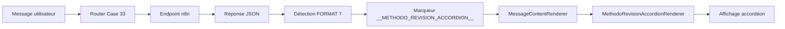

# Index - Intégration Template Orion (Méthodologie de Révision)

**Date**: 27 Mars 2026  
**Objectif**: Afficher les réponses de l'endpoint `methodo_revision` en menu accordéon avec page de couverture

---

## 📋 Fichiers de démarrage rapide

| Fichier | Description | Priorité |
|---------|-------------|----------|
| **QUICK_START_METHODO_REVISION.txt** | Guide de démarrage rapide avec instructions visuelles | ⭐⭐⭐ |
| **00_INTEGRATION_METHODO_REVISION_COMPLETE.txt** | Récapitulatif complet de l'intégration | ⭐⭐⭐ |
| **test-methodo-revision.ps1** | Script PowerShell pour tester l'endpoint | ⭐⭐ |

---

## 📚 Documentation détaillée

| Fichier | Description | Contenu |
|---------|-------------|---------|
| **INTEGRATION_METHODO_REVISION_TEMPLATE_ORION.md** | Documentation technique complète | - Vue d'ensemble<br>- Flux de traitement<br>- Structure des données<br>- Caractéristiques<br>- Tests<br>- Références |

---

## 💻 Fichiers de code créés

| Fichier | Type | Description |
|---------|------|-------------|
| **src/components/Clara_Components/MethodoRevisionAccordionRenderer.tsx** | React Component | Composant principal du Template Orion pour afficher l'accordéon |

---

## 🔧 Fichiers de code modifiés

| Fichier | Modifications | Lignes modifiées |
|---------|---------------|------------------|
| **src/services/claraApiService.ts** | Ajout FORMAT 7 pour détecter methodo_revision | ~30 lignes |
| **src/components/Clara_Components/MessageContentRenderer.tsx** | Import et rendu du nouveau composant | ~20 lignes |

---

## 🎯 Flux de traitement



---

## 📊 Structure des données

### Format d'entrée (n8n)

```json
[
  {
    "Sous-section": "AA040 — Rapprochements bancaires | Cadrage...",
    "Sub-items": [
      {
        "Sub-item 1A": "Cadrage du test",
        "Items": [
          {
            "Item 1A.1": "Référence et domaine",
            "Rubrique": "référence",
            "Contenu": "Référence : AA040..."
          }
        ]
      }
    ]
  }
]
```

### Format de sortie (Marqueur)

```
__METHODO_REVISION_ACCORDION__[JSON_DATA]
```

---

## 🎨 Caractéristiques du Template Orion

| Caractéristique | Description |
|----------------|-------------|
| **Couleur principale** | Bleu (#3b82f6) |
| **Page de couverture** | Gradient bleu avec titre et séparateur |
| **Accordéon** | Sections cliquables expand/collapse |
| **Badges** | Rubriques colorées automatiquement |
| **Support listes** | Arrays dans le contenu |
| **Mode sombre** | Supporté |
| **Responsive** | Design adaptatif |

---

## 🧪 Tests

### Test automatique

```powershell
powershell test-methodo-revision.ps1
```

### Test manuel

1. Démarrer les services
2. Ouvrir http://localhost:5173
3. Envoyer: "Methodo revision"
4. Vérifier l'affichage de l'accordéon

---

## ✅ Checklist de vérification

- [x] Composant `MethodoRevisionAccordionRenderer.tsx` créé
- [x] Détection FORMAT 7 ajoutée dans `claraApiService.ts`
- [x] Import et rendu ajoutés dans `MessageContentRenderer.tsx`
- [x] Pas d'erreurs TypeScript
- [x] Compatibilité avec les autres formats préservée
- [x] Documentation créée
- [x] Script de test créé

---

## 🔍 Détection automatique

Le système détecte automatiquement qu'il s'agit d'une réponse `methodo_revision` si :

1. **Structure** : Array avec objets contenant `"Sous-section"` et `"Sub-items"`
2. **Contenu** : La première sous-section contient :
   - Références de test (ex: "AA040", "AA050")
   - Mots-clés : "Rapprochements", "Cadrage", "audit", "contrôle"

---

## 🎯 Compatibilité

### Endpoints compatibles

- ✅ `methodo_revision` (Case 33) - **NOUVEAU**
- ✅ `methodo_audit` (Case 28)
- ✅ `cia_cours_gemini` (Case 11)
- ✅ `guide_des_commandes` (Case 29)
- ✅ Tous les autres endpoints existants

### Formats supportés

- ✅ Contenu texte simple
- ✅ Contenu avec listes (arrays)
- ✅ Contenu multiligne
- ✅ Caractères spéciaux et accents

---

## 🚀 Prochaines étapes possibles

1. **Ajout de vidéos** : Intégrer des vidéos de formation spécifiques à la révision
2. **Export PDF** : Permettre l'export de la méthodologie en PDF
3. **Recherche** : Ajouter une fonction de recherche dans les items
4. **Favoris** : Permettre de marquer des items comme favoris
5. **Notes** : Permettre d'ajouter des notes personnelles

---

## 📞 Support

En cas de problème :

1. Consulter **QUICK_START_METHODO_REVISION.txt** pour les problèmes courants
2. Vérifier les logs dans la console du navigateur (F12)
3. Tester l'endpoint avec `test-methodo-revision.ps1`
4. Consulter la documentation complète dans **INTEGRATION_METHODO_REVISION_TEMPLATE_ORION.md**

---

## 📝 Notes de version

### Version 1.0 - 27 Mars 2026

- ✅ Création du composant `MethodoRevisionAccordionRenderer`
- ✅ Intégration dans `claraApiService.ts` (FORMAT 7)
- ✅ Intégration dans `MessageContentRenderer.tsx`
- ✅ Documentation complète
- ✅ Script de test PowerShell
- ✅ Compatibilité avec les formats existants

---

## 🎉 Résultat

Le Template Orion est maintenant pleinement intégré dans Claraverse. Les réponses de l'endpoint `methodo_revision` s'affichent automatiquement dans un menu accordéon professionnel avec page de couverture bleue, sections cliquables, et badges de rubrique colorés.

**Pour commencer** : Ouvrez **QUICK_START_METHODO_REVISION.txt**
