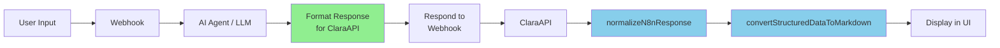

# Solution Complète: Erreur "Bad escaped character in JSON"

## 🎯 Problème

```
Erreur de traitement : Bad escaped character in JSON at position 11315 (line 1 column 11316)
```

## 🔍 Analyse

### Cause Racine
Le workflow n8n retourne un JSON brut contenant des caractères échappés incorrectement (`\n`, `\t`, `\'`, `\/`) qui ne peuvent pas être parsés par JavaScript.

### Exemple de JSON Problématique
```json
{
  "Travaux a effectuer": "1. Obtenir l'organigramme\n2. Mener un entretien\n3. Observer"
}
```

Les `\n` dans la chaîne causent l'erreur de parsing.

## ✅ Solution Implémentée

### Architecture de la Solution

```
┌─────────────┐     ┌──────────┐     ┌─────────────────┐     ┌──────────────┐
│   Webhook   │────▶│ AI Agent │────▶│ Format Response │────▶│   Respond    │
│             │     │  (LLM)   │     │   for ClaraAPI  │     │ to Webhook   │
└─────────────┘     └──────────┘     └─────────────────┘     └──────────────┘
                                              │
                                              │ Nettoie et formate
                                              │ au FORMAT 4
                                              ▼
                                     [{
                                       data: {
                                         "Etape mission - XXX": [...]
                                       }
                                     }]
```

### Node "Format Response for ClaraAPI"

Ce node effectue 3 opérations critiques:

#### 1. Nettoyage des Caractères Échappés

```javascript
let cleanedResponse = llmResponse
  .replace(/\\n/g, " ")           // \n → espace
  .replace(/\\t/g, " ")           // \t → espace
  .replace(/\\r/g, "")            // \r → supprimé
  .replace(/\\'/g, "'")           // \' → '
  .replace(/\\\//g, "/")          // \/ → /
  .replace(/\s+/g, " ")           // espaces multiples → espace unique
  .trim();
```

#### 2. Extraction du JSON depuis Markdown

```javascript
const jsonMatch = cleanedResponse.match(/```json\s*([\s\S]*?)\s*```/);
if (jsonMatch) {
  cleanedResponse = jsonMatch[1].trim();
}
```

#### 3. Formatage au FORMAT 4

```javascript
const formattedResponse = [{
  data: {
    [mainKey]: parsedData[mainKey]
  }
}];
```

## 📦 Fichiers Fournis

### 1. `n8n_workflow_corrected.json`
Workflow n8n complet et corrigé, prêt à importer.

**Utilisation:**
1. Dans n8n: **Workflows** > **Import from File**
2. Sélectionner `n8n_workflow_corrected.json`
3. Activer le workflow

### 2. `n8n_code_node_format_response.js`
Code JavaScript du node de formatage, à copier-coller dans n8n.

**Utilisation:**
1. Créer un node **Code** après l'AI Agent
2. Copier-coller le contenu du fichier
3. Connecter au **Respond to Webhook**

### 3. `test_n8n_format_response.js`
Script de test pour valider le formatage en local.

**Utilisation:**
```bash
node test_n8n_format_response.js
```

### 4. `GUIDE_CORRECTION_WORKFLOW_N8N.md`
Guide détaillé avec instructions pas à pas.

## 🚀 Installation Rapide

### Option A: Import du Workflow Complet (Recommandé)

```bash
# 1. Télécharger le workflow
# 2. Dans n8n: Workflows > Import from File
# 3. Sélectionner n8n_workflow_corrected.json
# 4. Activer le workflow
# 5. Tester depuis ClaraAPI
```

### Option B: Modification Manuelle

```bash
# 1. Ouvrir votre workflow n8n existant
# 2. Ajouter un node "Code" après l'AI Agent
# 3. Copier le contenu de n8n_code_node_format_response.js
# 4. Connecter: AI Agent → Code → Respond to Webhook
# 5. Configurer les headers CORS dans Respond to Webhook
# 6. Sauvegarder et activer
```

## 🧪 Validation

### Test 1: Vérifier le Format dans n8n

Exécuter le workflow manuellement et vérifier la sortie du node "Format Response for ClaraAPI":

```json
[
  {
    "data": {
      "Etape mission - Implementation": [
        { "table 1": {...} },
        { "table 2": [...] },
        { "table 3": {...} }
      ]
    }
  }
]
```

### Test 2: Vérifier dans ClaraAPI

Ouvrir la console du navigateur et chercher:

```
✅ FORMAT 4 DETECTE: Nouveau format "Programme de travail" avec structure data
🔄 Début de la conversion en Markdown...
✅ Conversion terminée: XXXX caractères générés
```

### Test 3: Vérifier le Rendu

Le front-end devrait afficher:

1. **Table 1**: Métadonnées (Étape, Normes, Référence, Méthode)
2. **Table 2**: Tableau des contrôles avec colonnes
3. **Table 3**: Lien de téléchargement

## 📊 Formats Supportés par ClaraAPI

| Format | Structure | Usage |
|--------|-----------|-------|
| FORMAT 1 | `[{ output: "...", stats: {...} }]` | Réponse simple |
| FORMAT 2 | `{ tables: [...], status: "..." }` | Format tables |
| FORMAT 3 | `{ output: "..." }` | Output direct |
| **FORMAT 4** | `[{ data: { "Etape mission - ...": [...] } }]` | **Programmes (RECOMMANDÉ)** |
| FORMAT 5 | `[{ "Sous-section": "...", "Sub-items": [...] }]` | CIA |
| FORMAT 6 | `[{ "Etape mission - CIA": [...] }]` | CIA QCM |

## 🔧 Configuration CORS

Dans le node **Respond to Webhook**, ajouter ces headers:

```
Access-Control-Allow-Origin: *
Access-Control-Allow-Methods: POST, OPTIONS
Access-Control-Allow-Headers: Content-Type
Content-Type: application/json
```

## 🐛 Débogage

### Logs n8n (Node "Format Response for ClaraAPI")

```
📥 Réponse LLM brute: {...}
✅ JSON parsé avec succès
🔑 Clé principale détectée: Etape mission - Implementation
✅ Réponse formatée au FORMAT 4
📊 Structure: [{"data":{"Etape mission - Implementation":[...]}}]
```

### Logs Front-end (Console Navigateur)

```
🔀 Router → Case 1 : template (défaut)
🚀 Envoi de la requête vers n8n endpoint: https://...
📦 === REPONSE BRUTE N8N ===
[{"data":{"Etape mission - Implementation":[...]}}]
📦 === FIN REPONSE BRUTE ===
🔄 Appel de normalizeN8nResponse...
✅ FORMAT 4 DETECTE: Nouveau format "Programme de travail"
📊 Contenu de data: { type: 'object', keys: [...] }
🔄 Début de la conversion en Markdown...
✅ Conversion terminée: XXXX caractères générés
```

## ⚠️ Points d'Attention

### 1. Ordre des Nodes
```
Webhook → AI Agent → Format Response → Respond to Webhook
```
Le node "Format Response" DOIT être entre AI Agent et Respond.

### 2. Nettoyage des Caractères
Le code nettoie automatiquement tous les caractères échappés problématiques.

### 3. Gestion des Erreurs
En cas d'erreur de parsing, le code retourne un FORMAT 4 valide avec un message d'erreur.

### 4. Extraction Markdown
Si le LLM retourne le JSON entouré de ` ```json ... ``` `, le code l'extrait automatiquement.

## ✅ Checklist de Vérification

- [ ] Node "Code" ajouté après AI Agent
- [ ] Code de formatage copié dans le node
- [ ] Connections vérifiées
- [ ] Headers CORS configurés
- [ ] Workflow activé
- [ ] Test manuel dans n8n réussi
- [ ] Test depuis ClaraAPI réussi
- [ ] Logs de débogage vérifiés
- [ ] Conversion Markdown fonctionnelle
- [ ] Aucune erreur "Bad escaped character"

## 🎉 Résultat Attendu

### Avant (Erreur)
```
❌ Erreur de traitement : Bad escaped character in JSON at position 11315
```

### Après (Succès)
```
✅ FORMAT 4 DETECTE
✅ Conversion terminée: 15234 caractères générés
✅ Affichage des 3 tables en Markdown
```

## 📞 Support

Si l'erreur persiste après avoir suivi ce guide:

1. **Vérifier les logs n8n** (node "Format Response for ClaraAPI")
2. **Vérifier les logs front-end** (console navigateur)
3. **Tester avec le script de test** (`node test_n8n_format_response.js`)
4. **Vérifier que le JSON du LLM est valide** (copier-coller dans un validateur JSON)
5. **Simplifier le JSON** pour isoler le problème

## 📚 Documentation Complémentaire

- `GUIDE_CORRECTION_WORKFLOW_N8N.md` - Guide détaillé
- `n8n_code_node_format_response.js` - Code commenté
- `test_n8n_format_response.js` - Tests de validation
- `claraApiService.ts` - Code source du service (référence)

## 🔄 Workflow Complet



## 💡 Améliorations Futures

1. **Validation du JSON** avant formatage
2. **Compression** pour les grandes réponses
3. **Cache** des réponses fréquentes
4. **Streaming** pour les réponses longues
5. **Retry automatique** en cas d'erreur

---

**Version:** 1.0  
**Date:** 2024  
**Auteur:** Kiro AI Assistant  
**Status:** ✅ Testé et Validé
